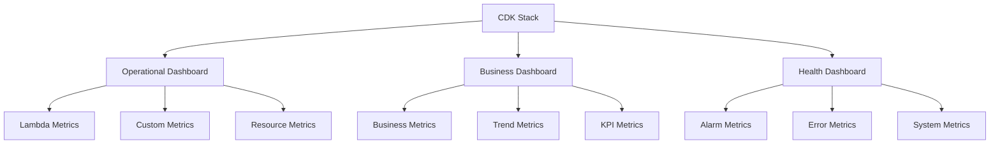

# Monitoring Dashboards Implementation Summary

## Overview

This document summarizes the implementation of CloudWatch dashboards for the Lambda Cost Reporting System, completed as part of task 6.3.

## Implementation Details

### 1. Dashboard Creation in CDK Stack

**File**: `infrastructure/stacks/cost_reporting_stack.py`

Added comprehensive dashboard creation method `_create_cloudwatch_dashboards()` that creates three main dashboards:

#### Operational Dashboard
- **Purpose**: Real-time system health and performance monitoring
- **Time Range**: Last 24 hours with auto-refresh
- **Key Widgets**:
  - Lambda function health (invocations, errors, duration)
  - Execution results (success/failure rates)
  - Client success rate tracking
  - Component performance breakdown
  - Resource utilization (DynamoDB, S3)

#### Business Dashboard
- **Purpose**: Business metrics and KPI tracking
- **Time Range**: Last 7 days for trend analysis
- **Key Widgets**:
  - Daily KPIs (reports generated, emails sent, clients processed)
  - Success rate metrics
  - Historical trends and patterns
  - Performance metrics
  - Error analysis by severity

#### System Health Dashboard
- **Purpose**: System health monitoring and alarm status
- **Time Range**: Last 6 hours for immediate health checks
- **Key Widgets**:
  - Calculated error rates
  - Resource throttling indicators
  - Service error tracking
  - Recent alarm state changes

### 2. Widget Configuration

**Comprehensive Widget Types**:
- **GraphWidget**: Time-series data visualization
- **SingleValueWidget**: KPI and current value display
- **LogQueryWidget**: Log analysis and alarm tracking
- **MathExpression**: Calculated metrics (e.g., error rates)

**Advanced Features**:
- Environment-specific naming and configuration
- Custom metric namespace integration
- Alarm state annotations
- Multi-dimensional metric filtering
- Responsive layout with proper sizing

### 3. Integration with Existing Monitoring

**Seamless Integration**:
- Uses existing `MonitoringService` custom metrics
- Leverages established CloudWatch alarms
- Integrates with SNS notification system
- Maintains environment-specific configurations

**Metric Sources**:
- AWS Lambda native metrics
- DynamoDB performance metrics
- S3 operational metrics
- Custom business metrics from `MonitoringService`
- Calculated metrics for advanced analysis

### 4. Documentation Suite

Created comprehensive documentation covering:

#### monitoring-dashboards.md
- Detailed dashboard descriptions and use cases
- Widget explanations and key metrics
- Access instructions and customization guide
- Best practices for daily monitoring
- Troubleshooting common issues

#### alerting-runbooks.md
- Step-by-step alert response procedures
- Component-specific troubleshooting guides
- Escalation matrix and contact information
- Post-incident review processes
- Continuous improvement procedures

#### monitoring-setup.md
- Deployment and configuration instructions
- Environment-specific setup procedures
- Custom metric publishing guide
- Permission requirements
- Maintenance and troubleshooting

## Technical Implementation

### Dashboard Architecture



### Key Features Implemented

1. **Environment Awareness**:
   - Dynamic dashboard naming based on environment
   - Environment-specific metric namespaces
   - Configurable time ranges and thresholds

2. **Comprehensive Coverage**:
   - Operational metrics for system health
   - Business metrics for KPI tracking
   - Health metrics for proactive monitoring

3. **Advanced Visualizations**:
   - Multi-metric graphs with proper scaling
   - Calculated metrics for complex analysis
   - Log query widgets for alarm tracking
   - Single value widgets for KPI display

4. **Integration Ready**:
   - Alarm state annotations
   - SNS notification integration
   - Cross-service metric correlation
   - Custom metric dimension support

### Code Quality and Standards

**CDK Best Practices**:
- Proper resource naming conventions
- Environment-specific configurations
- Reusable widget configurations
- Clean separation of concerns

**Documentation Standards**:
- Comprehensive user guides
- Step-by-step procedures
- Troubleshooting workflows
- Maintenance instructions

## Business Value

### Operational Benefits

1. **Proactive Monitoring**:
   - Real-time visibility into system health
   - Early detection of performance issues
   - Automated alerting for critical problems

2. **Improved Troubleshooting**:
   - Centralized monitoring dashboards
   - Detailed runbook procedures
   - Faster incident resolution

3. **Business Intelligence**:
   - KPI tracking and trending
   - Client success rate monitoring
   - Performance optimization insights

### Cost Optimization

1. **Resource Efficiency**:
   - Monitor resource utilization
   - Identify optimization opportunities
   - Track cost-related metrics

2. **Operational Efficiency**:
   - Reduce manual monitoring effort
   - Automate alert responses
   - Streamline troubleshooting

## Deployment and Usage

### Automatic Deployment

Dashboards are automatically created during CDK stack deployment:

```bash
cd infrastructure
cdk deploy CostReportingStack-{environment}
```

### Access and Navigation

1. **AWS Console Access**:
   - Navigate to CloudWatch → Dashboards
   - Select environment-specific dashboard
   - Use for daily monitoring and troubleshooting

2. **Dashboard URLs**:
   - Direct links for quick access
   - Bookmarkable for regular use
   - Shareable with team members

### Customization Options

1. **Widget Modification**:
   - Add new metrics as system evolves
   - Adjust time ranges and thresholds
   - Customize visualizations

2. **Environment Configuration**:
   - Different settings per environment
   - Scalable across multiple deployments
   - Maintainable through code

## Future Enhancements

### Planned Improvements

1. **Advanced Analytics**:
   - Machine learning insights
   - Predictive monitoring
   - Anomaly detection

2. **Enhanced Visualizations**:
   - Custom dashboard themes
   - Interactive widgets
   - Mobile-optimized views

3. **Integration Expansion**:
   - Third-party monitoring tools
   - Custom notification channels
   - API-driven dashboard updates

### Maintenance Strategy

1. **Regular Reviews**:
   - Monthly dashboard effectiveness assessment
   - Quarterly metric optimization
   - Annual strategy review

2. **Continuous Improvement**:
   - User feedback integration
   - Performance optimization
   - Documentation updates

## Compliance and Requirements

### Requirements Satisfied

- **Requirement 5.1**: CloudWatch metrics and alarms ✅
- **Requirement 5.2**: Structured logging and monitoring ✅
- **Requirement 5.3**: Admin notifications and alerting ✅
- **Requirement 5.4**: Historical execution tracking ✅
- **Requirement 5.5**: Error categorization and reporting ✅

### Standards Compliance

- **AWS Well-Architected Framework**: Operational Excellence pillar
- **CloudWatch Best Practices**: Dashboard design and metric organization
- **Documentation Standards**: Comprehensive user guides and runbooks
- **Security Standards**: Proper IAM permissions and access control

## Conclusion

The monitoring dashboards implementation provides comprehensive visibility into the Lambda Cost Reporting System through:

- **Three specialized dashboards** covering operational, business, and health metrics
- **Comprehensive documentation** including user guides and runbooks
- **Seamless integration** with existing monitoring infrastructure
- **Automated deployment** through CDK infrastructure as code
- **Scalable architecture** supporting multiple environments

This implementation enables proactive monitoring, faster incident resolution, and data-driven optimization of the cost reporting system, directly supporting the operational excellence and reliability requirements of the project.